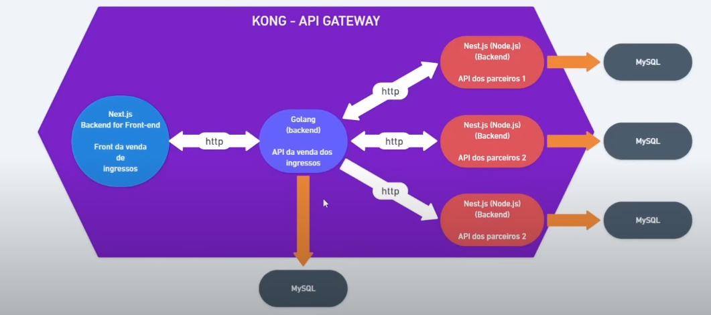

# Imersão Fullcycle 18 - Sistema de Venda de Ingressos

Participe gratuitamente: https://imersao.fullcycle.com.br/

## Sobre o repositório

Esse repositório contém todo código utilizado durante as aulas para referência.

Faça seu fork e também nos dê uma estrelinha para nos ajudar a divulgar o projeto.

As instruções de instalações estão no README.md de cada projeto.

---

## Arquitetura geral da aplicação

## Sobre o projeto

O projeto consiste em um sistema de venda de ingressos, caracterizado por uma arquitetura robusta. O front-end é desenvolvido utilizando o framework Next.js, proporcionando uma interface intuitiva para visualização, reserva de lugares e compra de ingressos disponíveis para eventos. O back-end, implementado em Go (Golang), é responsável por fornecer dados ao front-end e realizar a integração com aplicações parceiras, desenvolvidas em NestJS, que são operadas pelos organizadores dos eventos.

Uma característica distintiva deste sistema é a implementação do conceito de multi-tenancy, permitindo que múltiplos parceiros (donos de eventos) utilizem a mesma infraestrutura de maneira isolada e segura. Cada parceiro possui seu próprio conjunto de dados e configurações, garantindo a segregação e personalização necessárias para atender às suas necessidades específicas.

A comunicação entre os diversos serviços é realizada via HTTP, e é eficientemente orquestrada pelo Kong Gateway, que atua como um API Gateway, gerenciando as rotas e assegurando a segurança e escalabilidade do tráfego de dados entre os componentes do sistema.

Este projeto exemplifica a aplicação de práticas modernas de desenvolvimento, incluindo a separação de responsabilidades entre front-end e back-end, a utilização de tecnologias de ponta para garantir performance e escalabilidade, e a adoção de soluções de integração que permitem a expansão e personalização de funcionalidades conforme as necessidades dos parceiros.

## Tecnologias Utilizadas

### Front-End

- <b>Next.js:</b> Framework React focado em performance e SEO. Oferece renderização híbrida (SSR e SSG), roteamento automático, otimização de imagens e suporte a API Routes, permitindo a construção de aplicações web rápidas e escaláveis.

### Back-End

- <b>Golang (Go):</b> Linguagem de programação utilizada para o desenvolvimento do servidor principal. Go é conhecida por sua eficiência, performance e capacidade de lidar com operações concorrentes, tornando-a ideal para aplicações de alta demanda e baixa latência.

- <b>NestJS:</b> Framework Node.js utilizado pelos parceiros para construir microserviços. NestJS é baseado em TypeScript e oferece uma arquitetura modular, facilitando a criação de aplicativos escaláveis e de fácil manutenção.

### Integração e Comunicação

- <b>Kong Gateway:</b> Utilizado como API Gateway para gerenciar, monitorar e proteger as APIs. Kong Gateway oferece uma camada de abstração que permite a escalabilidade e segurança das comunicações HTTP entre os serviços, além de facilitar a implementação de políticas de autenticação, rate limiting, e logging.

### Banco de Dados

- <b>MySQL:</b> Banco de dados relacional utilizado para armazenamento de dados transacionais. MySQL é amplamente reconhecido por sua confiabilidade, escalabilidade e desempenho em ambientes de produção. Oferece suporte completo a transações ACID (Atomicidade, Consistência, Isolamento e Durabilidade), tornando-o ideal para aplicações que exigem alta disponibilidade e integridade dos dados.

### Infraestrutura

- <b>Docker:</b> Utilizado para containerização das aplicações, garantindo consistência entre ambientes de desenvolvimento, teste e produção. Docker facilita a implantação e escalabilidade dos serviços.
